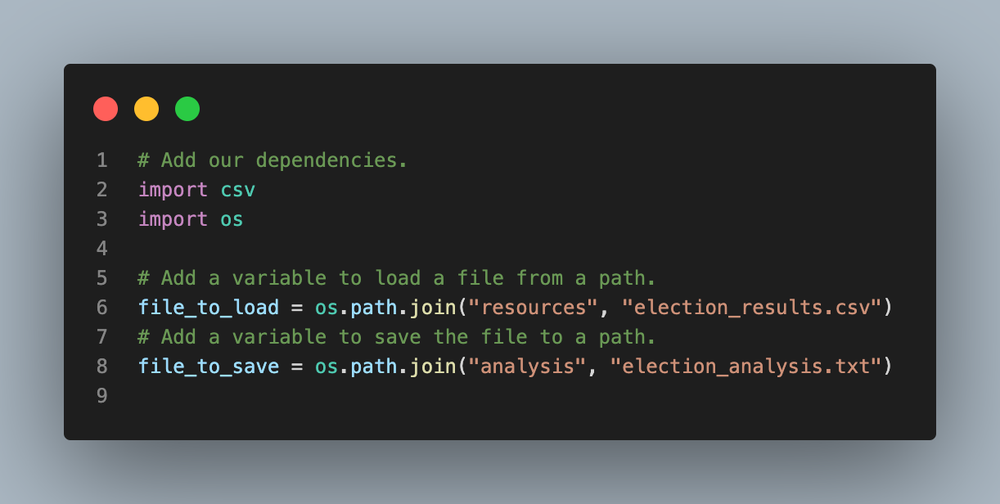

# PyPoll with Python

## Project Overview

---

Our client, a Colorado Board of Elections employee, Tom, has given us the following tasks to complete the election audit of a recent local congressional election:

1. Calculate the total number of votes cast.
2. Get a complete list of candidates who received votes.
3. Calculate the total number of votes each candidate received.
4. Calculate the percentage of votes each candidate won.
5. Determine the winner of the election based on popular vote.

<br>

### Purpose

The purpose of this election analysis was to create a program, using python, alongside our client- Tom- that automated the process of auditing the election, and lastly, to generate a vote count report to certify the U.S. congressional race being analysed. 

<br>

## Resources

---

* Data Source: *election_results.csv*
    <p float="left">
        
    </p>    

* Software: *Python 3.10.7, Visual Studio Code 1.71.0*
    <p float="left">
        
    </p>     

<br>

## Analysis & Results

---

The analysis of the election show that:

* There were 369,711 votes cast in the election.
* The counties were:

    |                  | Jefferson | Denver  | Arapahoe |   |
    |------------------|-----------|---------|----------|:-:|
    | # of Votes       | 38,855    | 306,055 | 24,801   |   |
    | % of Total Votes | 10.5%     | 82.8%   | 6.7%     |   |
    |                  |           |         |          |   |
* **Denver** had the largest number of votes
* The candidates were:
    |                  | Charles Casper Stockham | Diana DeGette  | Raymon Anthony Doana |   |
    |------------------|-----------|---------|----------|:-:|
    | # of Votes       | 85,213    | 272,892 | 11,606   |   |
    | % of Total Votes | 23.0%     | 73.8%   | 3.1%     |   |
    |                  |           |         |          |   |
* **Diana DeGette** won the election with 272,892 votes and 73.8% of the total votes

<br>

## Summary

---

We believe that we've created an easy-to-understand program to generate a straightforward report on any U.S. congressional election; as long as the scope of data is maintained. Obviously, if more parameters for analysis such as voter age were to also be given, we would have to add more code for those areas. However, this raises an important point regarding the modifications that would improve the output of this program. 

We can suggest at least two improvements:
1. Instead of writing to a .txt file, we could be writing to a .csv file. This would allow us to directly interact with the data to create visualizations. While one may argue that a .txt file would be simpler to convey, we think that charts and tabular data are visually more assistive and appealing for comprehension. 

2. We believe that our program could've been organized better. Some observations regarding the winner were spread out among multiple variables like the ones on line 25-34 of the [challenge program](PyPoll_Challenge_starter_code.py):

    ```
    # Track the winning candidate, vote count and percentage
    winning_candidate = ""
    winning_count = 0
    winning_percentage = 0

    # 2: Track the largest county and county voter turnout.

    winner_county = ""
    winner_count_co = 0
    winner_percentage_co = 0
    ```
    Instead of creating number variables as in the above case, we could be storing all this data in dictionaries. While it means more time and money dedicated towards refactoring the code, in the end, a more efficent program is being created.

We hope we were able to provide you with useful suggestions, and most importantly, a fully functioning program to your satisfaction.
